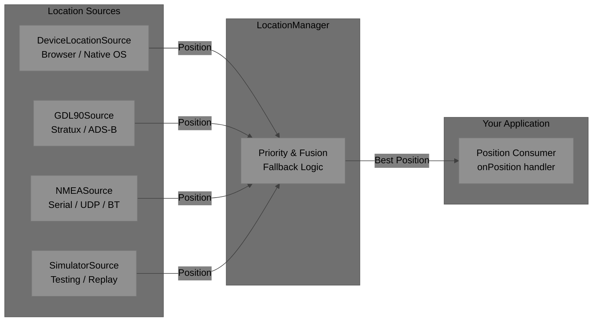
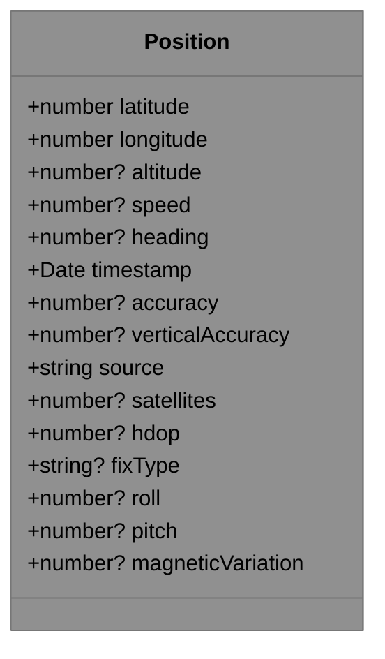
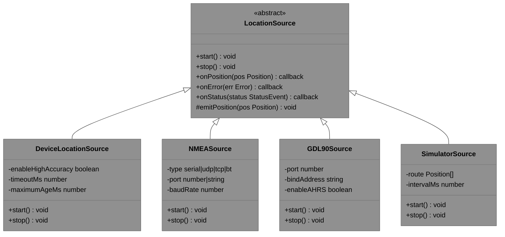
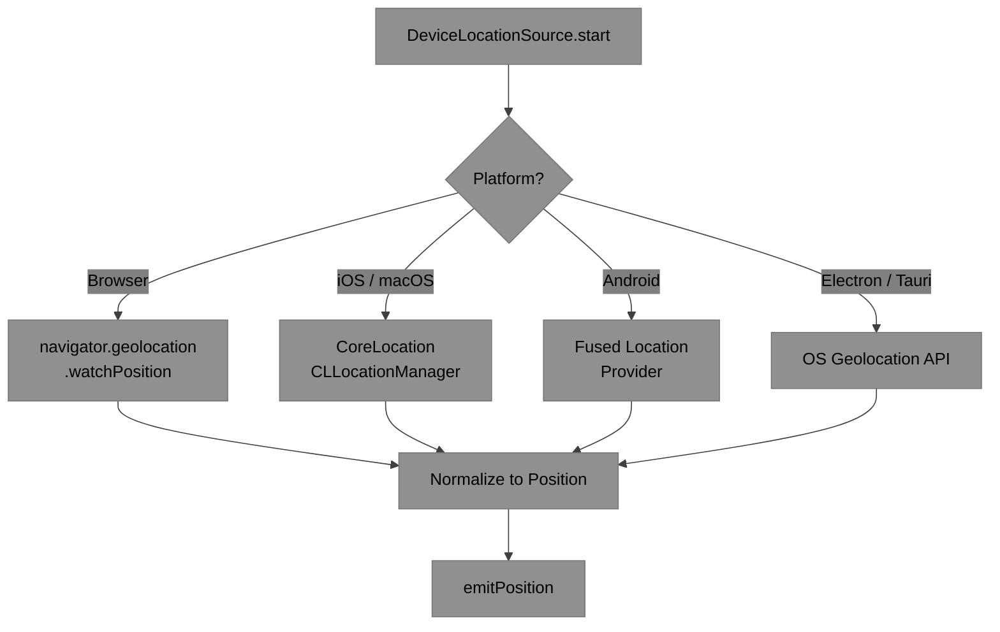
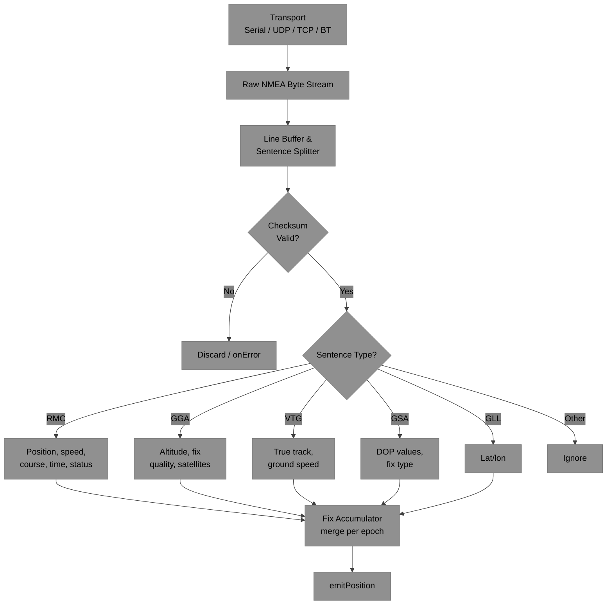
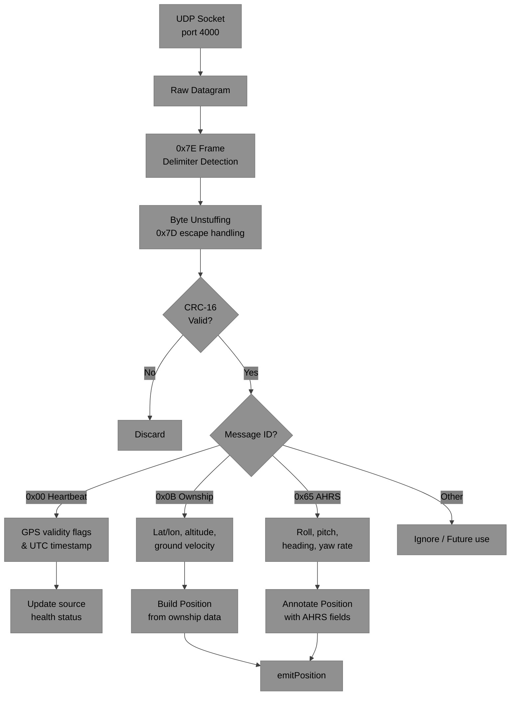
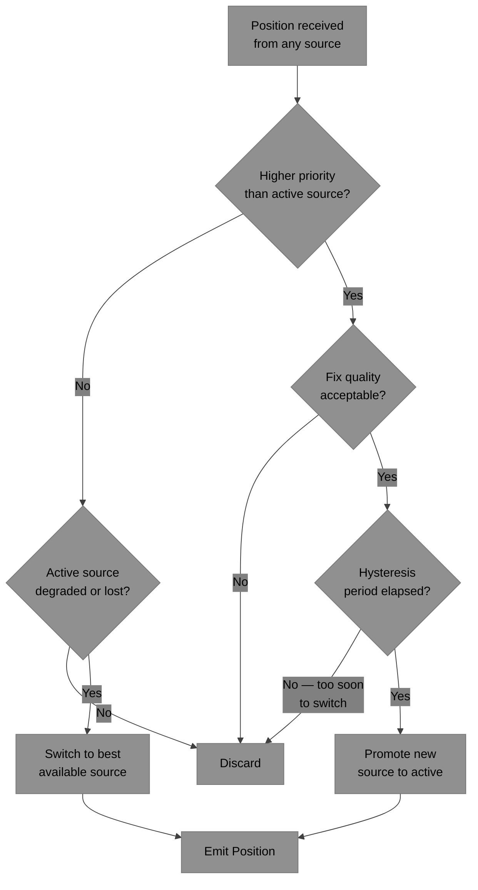
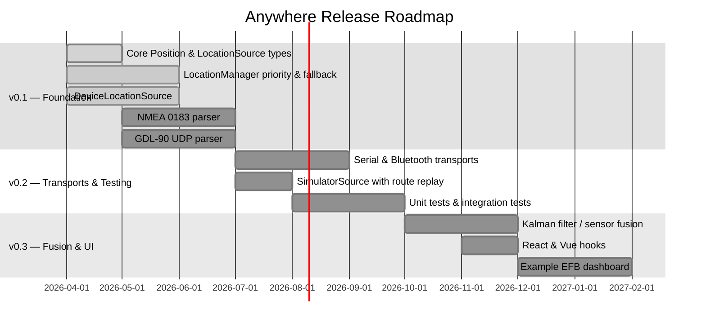

# Anywhere — Unified Location Library

**Get reliable position data from any source** — device GPS, NMEA 0183, GDL-90, and more.

`@visionik/anywhere` (or `libanywhere`) is a lightweight TypeScript library that normalizes GPS/location data from multiple heterogeneous sources into a single, consistent `Position` interface. It supports automatic source prioritization, seamless fallback, and easy extension for new providers.

Perfect for aviation apps (EFBs, Stratux/ForeFlight-style tools), drone software, marine navigation, or any project that needs robust, reliable location from diverse hardware or OS APIs.

---

## Architecture Overview

Anywhere is built around a **source → manager → consumer** pipeline. Each location provider implements a common `LocationSource` interface, and the `LocationManager` orchestrates them: selecting the highest-quality active source, falling back automatically when a source degrades, and emitting a single unified stream of normalized `Position` events to your application.



This design means you can add or remove sources at runtime without changing your application logic. Your app always receives the same `Position` shape, regardless of which hardware is currently active.

---

## Core Concepts

### The `Position` Interface

Every source in Anywhere emits a normalized `Position` object — regardless of whether the data originated from a browser's Geolocation API, a serial NMEA receiver, or a GDL-90 UDP broadcast. This eliminates format-specific handling in your application code.

The interface captures the most useful fields from aviation-grade GPS receivers:

- **Coordinates** — WGS84 decimal degrees latitude/longitude and meters MSL altitude
- **Motion** — ground speed (m/s) and true heading (degrees 0–360)
- **Fix quality** — fix type (2D, 3D, DGPS, RTK), HDOP, and satellite count
- **Accuracy** — horizontal and vertical accuracy estimates in meters
- **AHRS extensions** — roll, pitch, and magnetic variation when available (e.g., from GDL-90 AHRS messages)
- **Source tag** — identifies which provider produced the fix, useful for debugging or display



```ts
export interface Position {
  latitude: number;           // decimal degrees, WGS84
  longitude: number;          // decimal degrees, WGS84
  altitude?: number;          // meters (MSL or geometric)
  speed?: number;             // meters per second
  heading?: number;           // degrees true (0–360)
  timestamp: Date;            // UTC time of the fix
  accuracy?: number;          // horizontal accuracy in meters
  verticalAccuracy?: number;  // vertical accuracy in meters
  source: 'device' | 'nmea' | 'gdl90' | 'simulator' | string;
  satellites?: number;        // satellites in fix
  hdop?: number;              // horizontal dilution of precision
  fixType?: 'none' | '2d' | '3d' | 'dgps' | 'rtk' | string;
  // AHRS extensions (GDL-90 / ForeFlight)
  roll?: number;              // degrees
  pitch?: number;             // degrees
  magneticVariation?: number; // degrees east/west
}
```

### The `LocationSource` Abstraction

All providers extend a common abstract base class. To add a new data source, you implement `start()` and `stop()`, call `emitPosition()` when you have data, and the manager handles the rest. The `onStatus` callback lets sources report connection health and fix quality in real time, enabling the manager to make informed fallback decisions.



### The `LocationManager`

`LocationManager` is the primary API surface. You configure it with one or more sources and a priority order; it handles lifecycle management, source health monitoring, and seamless fallback. Your application only needs to listen for `'position'` events.

```ts
const manager = new LocationManager({
  sources: [
    new DeviceLocationSource({ enableHighAccuracy: true }),
    new GDL90Source({ port: 4000 }),
    new NMEASource({ type: 'udp', port: 10110 }),
  ],
  priorityOrder: ['gdl90', 'nmea', 'device'],
  minUpdateIntervalMs: 200,
});

manager.on('position', (pos) => {
  console.log(`[${pos.source}] ${pos.latitude}, ${pos.longitude}`);
});

manager.on('sourceChange', (from, to) => {
  console.log(`Active source changed: ${from} → ${to}`);
});

manager.start();
```

---

## Location Sources

### 1. Device Location Source

The device source wraps the platform's native location API, providing a uniform interface across all major deployment targets. Whether running as a web app in a browser, a native mobile app via Capacitor, or a desktop app via Electron or Tauri, the same `DeviceLocationSource` API works everywhere.

| Platform | Underlying API |
|---|---|
| Browser / PWA | `navigator.geolocation` (W3C Geolocation API) |
| iOS & macOS | CoreLocation via Capacitor, React Native, or Electron bridge |
| Android | Fused Location Provider via Capacitor or native |
| Desktop (Electron / Tauri) | CoreLocation / Geolocator / GeoClue depending on OS |

The source supports both one-shot (`getCurrentPosition`) and continuous watch (`watchPosition`) modes, and reports accuracy degradation via `onStatus` so the manager can decide when to fall back to another source.



### 2. NMEA 0183 Source

NMEA 0183 is the universally supported serial protocol for GPS receivers — from budget USB dongles to panel-mounted avionics. The `NMEASource` supports multiple transport layers and parses all major fix-quality sentences.

**Transport options:**
- **Serial** — USB / RS-232 via WebSerial (browser) or Node.js `serialport`
- **UDP / TCP** — common for network-bridged receivers (e.g., GPSd, Stratux NMEA forwarding)
- **Bluetooth** — via platform BLE/SPP APIs
- **File replay** — for deterministic testing and simulation

**Sentences parsed:**

| Sentence | Content |
|---|---|
| `$xxRMC` | Position, speed, course, UTC time, status |
| `$xxGGA` | Position, altitude, fix quality, satellite count |
| `$xxVTG` | True/magnetic track, ground speed |
| `$xxGSA` | DOP values, fix type, active satellite IDs |
| `$xxGLL` | Geographic position (lat/lon only) |

The parser handles all standard talker ID prefixes (`GP`, `GN`, `GL`, `GA`), validates checksums, and assembles multi-sentence update cycles into a single coherent `Position` emission per fix epoch.



### 3. GDL-90 Source

GDL-90 is a binary UDP protocol originally defined by the FAA and widely adopted in portable ADS-B receivers. It is the native protocol for **Stratux**, uAvionix SkyEcho, Appareo Stratus (open mode), and many DIY ADS-B builds. Beyond ownship GPS position, GDL-90 delivers traffic reports, FIS-B weather data, and attitude (AHRS) data via the ForeFlight extension.

**Why GDL-90 matters for aviation:** A Stratux or similar receiver connected over Wi-Fi broadcasts GDL-90 on UDP port 4000. Any EFB that speaks GDL-90 can receive traffic, weather, and precise GPS without cellular service or an external GPS module — the receiver handles everything.

**Key messages decoded:**

| Message ID | Description |
|---|---|
| `0x00` Heartbeat | GPS validity flags, UTC timestamp, status bits |
| `0x0B` Ownship Report | Primary GPS position, geometric altitude, ground velocity |
| `0x65` ForeFlight AHRS | Roll, pitch, heading, yaw rate — full attitude data |

The source manages UDP socket binding, `0x7E` frame delimiter detection, byte unstuffing (`0x7D` escape sequences), and CRC-16/CCITT validation before decoding any message payload.



---

## Priority & Fallback Strategy

When multiple sources are active, `LocationManager` selects the best available fix using a configurable priority order combined with real-time quality signals. The strategy is conservative — it avoids switching sources unless there is a clear reason to do so, using hysteresis to prevent rapid oscillation.



**Tunable parameters:**
- **`priorityOrder`** — explicit ranked list of source names
- **`minUpdateIntervalMs`** — rate-limits position emissions (e.g., 200 ms prevents flooding)
- **`hysteresisMs`** — minimum time a higher-priority source must be healthy before promotion
- **`minQuality`** — minimum accuracy / HDOP threshold to consider a fix valid

---

## Getting Started

Install the package:

```bash
npm install @visionik/anywhere
```

Use all available sources, take the best fix automatically:

```ts
import { LocationManager, DeviceLocationSource, GDL90Source, NMEASource } from 'libanywhere';

const manager = new LocationManager({
  sources: [
    new DeviceLocationSource({ enableHighAccuracy: true }),
    new GDL90Source({ port: 4000 }),
    new NMEASource({ type: 'udp', port: 10110 }),
  ],
  priorityOrder: ['gdl90', 'nmea', 'device'],
  minUpdateIntervalMs: 200,
});

manager.on('position', (pos) => {
  console.log(`[${pos.source}] ${pos.latitude.toFixed(6)}, ${pos.longitude.toFixed(6)}`);
});

manager.start();
```

Browser-only (no hardware receiver):

```ts
import { LocationManager, DeviceLocationSource } from 'libanywhere';

const manager = new LocationManager();
manager.addSource(new DeviceLocationSource({ enableHighAccuracy: true }));
manager.on('position', (pos) => { /* ... */ });
manager.start();
```

---

## Roadmap



---

## License

MIT

---

*Made for pilots, builders, and developers who just want to know "where" — from anywhere.*
*Feedback, contributions, and Stratux/GDL-90 test reports are welcome!*

## Core Concepts

### Position Interface
All sources emit the same normalized data:

```ts
export interface Position {
  latitude: number;           // decimal degrees, WGS84
  longitude: number;          // decimal degrees, WGS84
  altitude?: number;          // meters (MSL or geometric)
  speed?: number;             // meters per second (or knots via helper)
  heading?: number;           // degrees true (0-360)
  timestamp: Date;            // UTC time of the fix
  accuracy?: number;          // horizontal accuracy in meters
  verticalAccuracy?: number;  // vertical accuracy in meters
  source: 'device' | 'nmea' | 'gdl90' | 'simulator' | string;
  satellites?: number;        // number of satellites in fix
  hdop?: number;              // horizontal dilution of precision
  fixType?: 'none' | '2d' | '3d' | 'dgps' | 'rtk' | string;
  // Optional extensions
  roll?: number;              // degrees (from AHRS)
  pitch?: number;
  magneticVariation?: number;
}
LocationSource Abstraction
Every provider implements this base class:
TypeScriptabstract class LocationSource {
  abstract start(): void;
  abstract stop(): void;

  onPosition?: (position: Position) => void;
  onError?: (error: Error) => void;
  onStatus?: (status: { connected: boolean; quality: number }) => void;

  protected emitPosition(pos: Position) {
    this.onPosition?.(pos);
  }
}
LocationManager (Main API)
The central class that manages multiple sources with priority and fusion:
TypeScriptconst manager = new LocationManager({
  sources: [
    new DeviceLocationSource({ enableHighAccuracy: true }),
    new GDL90Source({ port: 4000 }),
    new NMEASource({ type: 'udp', port: 10110 }),   // or serial
  ],
  priorityOrder: ['device', 'gdl90', 'nmea'],   // higher = preferred
  minUpdateIntervalMs: 200,
});

manager.on('position', (pos) => {
  console.log(`Position from ${pos.source}: ${pos.latitude}, ${pos.longitude}`);
});

manager.start();
First Implementation Providers
1. Device Location Source (iOS / macOS / Android / Windows / Linux / Browser)
Supported Platforms:

Browser / Web: navigator.geolocation (W3C Geolocation API)
iOS & macOS: Via Capacitor, React Native, or Electron + native bridge (CoreLocation)
Android: Via Capacitor or native fused location provider
Desktop (Electron / Tauri): Use Node.js bindings or electron + OS APIs (macOS: CoreLocation, Windows: Geolocator, Linux: GeoClue)

Features:

High-accuracy mode with speed, heading, and altitude when available
Continuous watching (watchPosition) or one-shot (getCurrentPosition)
Automatic fallback when accuracy degrades

Usage Example:
TypeScriptimport { DeviceLocationSource } from 'libanywhere';

const deviceSource = new DeviceLocationSource({
  enableHighAccuracy: true,
  timeoutMs: 10000,
  maximumAgeMs: 0,
});
2. NMEA 0183 Source
Transport Options:

Serial (USB/RS-232 via WebSerial or Node serialport)
UDP / TCP (common for bridged receivers)
Bluetooth (via platform APIs)
File replay (for testing)

Key Sentences Parsed:

RMC — Recommended Minimum Specific GPS Data (position, speed, course, time, status)
GGA — Global Positioning System Fix Data (position, altitude, fix quality, satellites)
VTG — Track made good and ground speed
GSA — GPS DOP and active satellites (HDOP, fix type)
GLL — Geographic position (lat/lon)

Features:

Robust sentence parsing with checksum validation
Automatic talker ID handling (GP, GN, GL, etc.)
Reassembly of multi-sentence updates into one Position

Usage Example:
TypeScriptconst nmeaSource = new NMEASource({
  type: 'serial',
  path: '/dev/ttyUSB0',   // or UDP port, etc.
  baudRate: 4800,
});
3. GDL-90 Source
Protocol Overview:

Binary UDP protocol (default port 4000)
Used by Stratux, uAvionix skyAlert/SkyEcho, Appareo Stratus (Open Mode), and many DIY ADS-B receivers
Includes ownship GPS position, traffic reports, FIS-B weather, and AHRS extensions

Key Messages Supported (initial implementation):

0x00 — Heartbeat (GPS validity, status flags, timestamp)
0x0B — Ownship Report (primary ownship position, altitude, velocity)
0x65 — ForeFlight AHRS extension (roll, pitch, heading, yaw rate)
Basic framing (0x7E), byte unstuffing, and CRC validation

Features:

UDP listener with optional unicast support
Automatic discovery (listens for ForeFlight-style broadcasts)
Integration of geometric altitude and pressure altitude when available

Usage Example:
TypeScriptconst gdl90Source = new GDL90Source({
  port: 4000,
  bindAddress: '0.0.0.0',
  enableAHRS: true,
});
Priority & Fusion Strategy (Planned)

Highest-priority source with valid fix → used immediately
If primary degrades (low accuracy, lost fix), seamless fallback to next source
Optional simple fusion (e.g., average position when multiple high-quality sources agree)
Configurable hysteresis to avoid rapid switching

Getting Started
Bashnpm install @visionik/anywhere   # or libanywhere
TypeScriptimport { LocationManager, DeviceLocationSource, GDL90Source, NMEASource } from 'libanywhere';

const manager = new LocationManager();
manager.addSource(new DeviceLocationSource());
manager.addSource(new GDL90Source());
manager.addSource(new NMEASource({ type: 'udp', port: 10110 }));

manager.start();
Roadmap (v0.1 → v1.0)

 Core Position and LocationSource types
 Device Geolocation
 NMEA 0183 parser (RMC/GGA/VTG/GSA)
 GDL-90 UDP parser (Heartbeat + Ownship + AHRS)
 Serial/Bluetooth transport helpers
 Priority manager + fusion
 Comprehensive tests + simulators
 React/Vue hooks and example EFB dashboard

License
MIT

Made for pilots, builders, and developers who just want to know "where" — from anywhere.
Feedback, contributions, and Stratux/GDL-90 test reports are welcome!
